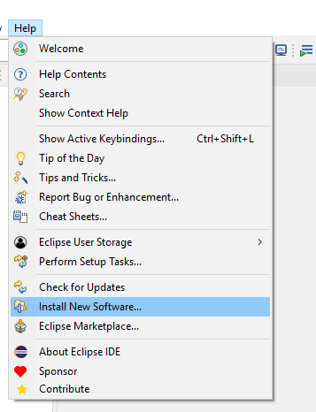
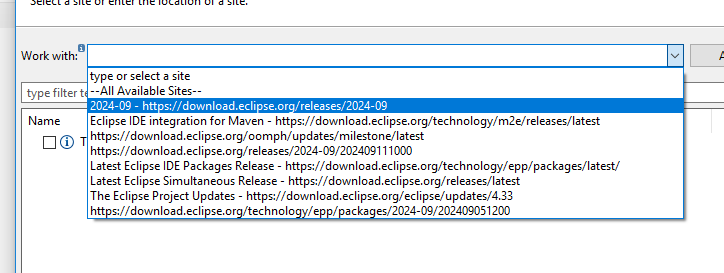
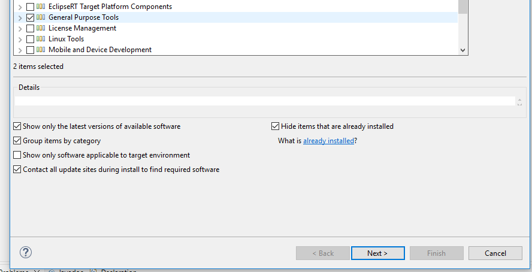
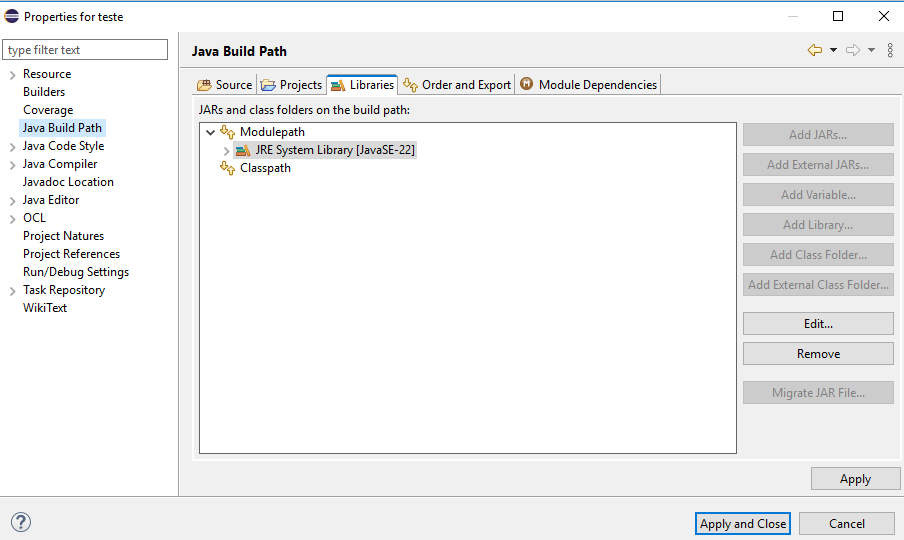

# Instalação do Java(eclipse)

Para rodar os projetos simples em java tranquilamente você deverá ter instalado

    - [JRE](https://www.java.com/pt-BR/download/manual.jsp)
    - [JDK 20](https://www.oracle.com/java/technologies/javase/jdk20-archive-downloads.html)
    - [Eclipse](https://www.eclipse.org/downloads/)
    - [JDBC 8 (para o banco de dados)](https://www.oracle.com/br/database/technologies/appdev/jdbc-downloads.html)

Assim que instalar tudo, abra o eclipse e na opção "help" e clique em "install new software"

após isso selecione a opção abaixo

marque o "general purpose tools" e siga os passos de instalação

agora pra importar o JDBC vá até as propriedades da pasta do projeto clicando com o bootão direito nele
No "java build path", na parte de "libraries" selecione o "classpath" e clique em "add external jars.."
após isso selecione o JDBC antes baixado.

